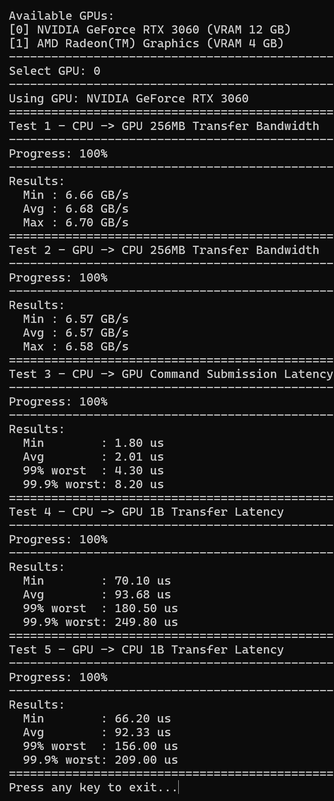

# GPU-PCIe-Test

A minimal CLI tool using DirectX 12 to measure GPU ↔ CPU transfer bandwidth and latencies, useful for verifying and troubleshooting PCIe performance.

## Requirements to Compile
- Windows 10 or later
- 64-bit C++17 project (Visual Studio)
- Windows SDK headers: `d3d12.h`, `dxgi1_6.h`, etc.
- Linker inputs: `d3d12.lib`, `dxgi.lib`

## Requirements to Run
- Windows 10 or later
- GPU with DirectX 12 support

## Example
